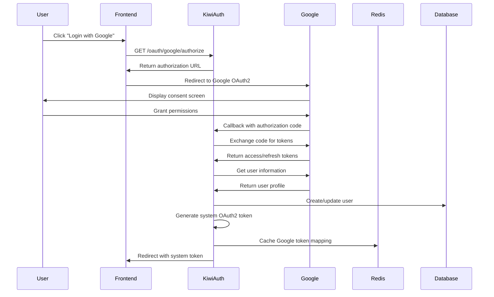
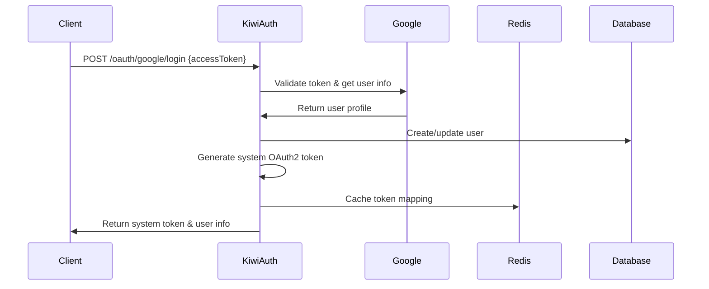

# Google SSO Integration Technical Documentation

## Overview

This document outlines the Google SSO (Single Sign-On) implementation in the Kiwi microservices application. The system integrates Google OAuth2 authentication with a custom OAuth2 token management system, providing seamless authentication for users while maintaining enterprise-level security and user management.

## Architecture Overview

```
┌─────────────────┐    ┌─────────────────┐    ┌─────────────────┐
│   Frontend      │    │   kiwi-auth     │    │   Google APIs   │
│   Application   │◄──►│   Service       │◄──►│   OAuth2        │
└─────────────────┘    └─────────────────┘    └─────────────────┘
                                │
                                ▼
                       ┌─────────────────┐    ┌─────────────────┐
                       │   Redis Cache   │    │   kiwi-upms     │
                       │   (Token Store) │    │   Service       │
                       └─────────────────┘    └─────────────────┘
                                │                       │
                                ▼                       ▼
                       ┌─────────────────┐    ┌─────────────────┐
                       │   Resource      │    │   MySQL         │
                       │   Servers       │    │   Database      │
                       └─────────────────┘    └─────────────────┘
```

## Core Components

### 1. Authentication Service (kiwi-auth)

#### GoogleOAuth2Controller
- **Location**: `kiwi-auth/src/main/java/me/fengorz/kiwi/auth/controller/GoogleOAuth2Controller.java`
- **Purpose**: Handles Google OAuth2 authentication flows
- **Key Endpoints**:
    - `GET /oauth/google/authorize` - Generate authorization URL
    - `GET /oauth/google/callback` - Handle OAuth2 callback
    - `POST /oauth/google/login` - Direct token login
    - `POST /oauth/google/refresh` - Refresh tokens
    - `POST /oauth/google/logout` - Logout and cleanup

#### GoogleOAuth2Service
- **Location**: `kiwi-auth/src/main/java/me/fengorz/kiwi/auth/service/GoogleOAuth2Service.java`
- **Purpose**: Core Google OAuth2 operations
- **Key Methods**:
    - `getAuthorizationUrl()` - Generates Google OAuth2 authorization URL
    - `exchangeCodeForToken()` - Exchanges authorization code for access token
    - `getUserInfo()` - Retrieves user information from Google
    - `refreshAccessToken()` - Refreshes expired Google tokens

#### GoogleTokenCacheService
- **Location**: `kiwi-bdf/src/main/java/me/fengorz/kiwi/bdf/security/google/GoogleTokenCacheService.java`
- **Purpose**: Manages Google token caching in Redis
- **Key Features**:
    - Caches Google access tokens and refresh tokens
    - Maps system tokens to Google tokens
    - Handles token expiration and cleanup
    - Provides token validation capabilities

### 2. User Management Service (kiwi-upms)

#### GoogleUserService
- **Location**: `kiwi-auth/src/main/java/me/fengorz/kiwi/auth/service/GoogleUserService.java`
- **Purpose**: Manages Google user integration with the UPMS system
- **Key Methods**:
    - `findOrCreateUser()` - Creates or updates users from Google info
    - `linkGoogleAccount()` - Links Google account to existing user
    - `convertToEnhancerUser()` - Converts to system user format

#### GoogleUserController
- **Location**: `kiwi-upms/kiwi-upms-biz/src/main/java/me/fengorz/kiwi/upms/controller/GoogleUserController.java`
- **Purpose**: API endpoints for Google user management
- **Key Endpoints**:
    - `POST /sys/user/google/createOrUpdate` - Create/update Google user
    - `POST /sys/user/google/link` - Link Google account
    - `POST /sys/user/google/unlink/{userId}` - Unlink Google account

## Authentication Flow

### 1. Authorization Code Flow



### 2. Direct Token Login Flow



## Token Management

### System Token Generation

The system generates its own OAuth2 tokens for Google SSO users:

```java
// Create OAuth2 access token
DefaultOAuth2AccessToken accessToken = new DefaultOAuth2AccessToken(UUID.randomUUID().toString());
accessToken.setExpiration(new Date(System.currentTimeMillis() + 30 * 24 * 60 * 60 * 1000L)); // 30 days
accessToken.setScope(scopes);
accessToken.setTokenType("Bearer");

// Create refresh token with expiration
Date refreshTokenExpiration = new Date(System.currentTimeMillis() + 90 * 24 * 60 * 60 * 1000L); // 90 days
OAuth2RefreshToken refreshToken = new DefaultExpiringOAuth2RefreshToken(
    UUID.randomUUID().toString(),
    refreshTokenExpiration
);
```

### Token Storage Strategy

#### Redis Cache Structure

```
Key Patterns:
- kiwi:google:token:{systemToken} → GoogleTokenCacheInfo (JSON)
- kiwi:google:refresh:{googleRefreshToken} → systemToken
- kiwi:google:mapping:{systemToken} → GoogleTokenCacheInfo (JSON)
- kiwi:oauth:access_token:{systemToken} → OAuth2AccessToken
```

#### GoogleTokenCacheInfo Structure

```json
{
  "systemToken": "uuid-generated-token",
  "googleAccessToken": "google-access-token",
  "googleRefreshToken": "google-refresh-token",
  "expiresIn": 3600,
  "googleUserInfo": {
    "id": "google-user-id",
    "email": "user@gmail.com",
    "name": "User Name",
    "picture": "profile-picture-url"
  },
  "cacheTime": 1640995200000
}
```

## Token Validation

### Enhanced Remote Token Services

The system uses `GoogleRemoteTokenServices` which extends Spring's `RemoteTokenServices`:

```java
@Override
public OAuth2Authentication loadAuthentication(String accessToken) throws InvalidTokenException {
    // 1. Try to load from local token store (for Google SSO tokens)
    OAuth2Authentication localAuth = tokenStore.readAuthentication(accessToken);
    
    if (localAuth != null) {
        // Check if it's a Google SSO token
        GoogleTokenCacheInfo googleTokenInfo = googleTokenCacheService.getGoogleTokenInfo(accessToken);
        
        if (googleTokenInfo != null) {
            // Validate Google token and enhance authentication
            return enhanceAuthenticationWithGoogleInfo(localAuth, googleTokenInfo);
        }
        
        return localAuth;
    }
    
    // 2. Fallback to remote validation for standard OAuth2 tokens
    return super.loadAuthentication(accessToken);
}
```

### Token Validation Process

1. **Local Token Store Check**: First checks if token exists in Redis
2. **Google Token Association**: Checks if token is associated with Google SSO
3. **Google Token Validation**: Validates Google token expiration and status
4. **Authentication Enhancement**: Adds Google-specific authorities and user info
5. **Fallback Validation**: Falls back to standard OAuth2 validation if needed

## Security Features

### 1. Token Expiration Management

- **System Tokens**: 30-day expiration with 90-day refresh tokens
- **Google Tokens**: Respect Google's expiration (typically 1 hour)
- **Automatic Cleanup**: Expired tokens are automatically cleaned from cache

### 2. Cross-Origin Resource Sharing (CORS)

- Configured to allow requests from specified origins
- Supports preflight requests for complex CORS scenarios

### 3. Token Refresh Strategy

```java
public Map<String, Object> refreshAccessToken(String refreshToken) {
    // Validate refresh token
    // Call Google's token refresh endpoint
    // Update cached token information
    // Return new access token
}
```

## Configuration

### Google OAuth2 Properties

```yaml
google:
  oauth2:
    client-id: ${GOOGLE_CLIENT_ID}
    client-secret: ${GOOGLE_CLIENT_SECRET}
    redirect-uri: ${GOOGLE_REDIRECT_URI}
    scopes:
      - openid
      - profile
      - email
    home-page: ${FRONTEND_URL}
    check-token-endpoint-url: http://kiwi-auth:3001/oauth/check_token
```

### Redis Configuration

```yaml
spring:
  redis:
    host: ${REDIS_HOST}
    port: ${REDIS_PORT}
    password: ${REDIS_PASSWORD}
```

## API Reference

### Authentication Endpoints

#### Get Authorization URL

```http
GET /oauth/google/authorize?state=optional-state
```

**Response:**
```json
{
  "code": 0,
  "msg": "success",
  "data": {
    "authorizationUrl": "https://accounts.google.com/o/oauth2/v2/auth?client_id=...",
    "state": "optional-state"
  }
}
```

#### Handle OAuth2 Callback

```http
GET /oauth/google/callback?code=auth-code&state=optional-state
```

**Response:** Redirects to frontend with token

#### Direct Token Login

```http
POST /oauth/google/login
Content-Type: application/json

{
  "accessToken": "google-access-token"
}
```

**Response:**
```json
{
  "code": 0,
  "msg": "success",
  "data": {
    "accessToken": "system-oauth2-token",
    "tokenType": "Bearer",
    "expiresIn": 2592000,
    "refreshToken": "refresh-token",
    "userInfo": {
      "id": "google-user-id",
      "email": "user@gmail.com",
      "name": "User Name",
      "picture": "profile-picture-url"
    }
  }
}
```

### Token Management Endpoints

#### Check Token

```http
POST /oauth/check_token
Content-Type: application/x-www-form-urlencoded

token=system-oauth2-token
```

**Response:**
```json
{
  "code": 0,
  "msg": "success",
  "data": {
    "client_id": "google-sso-client",
    "scope": ["read", "write", "profile", "email"],
    "active": true,
    "user_id": 123,
    "username": "user@gmail.com",
    "dept_id": 1,
    "authorities": ["ROLE_USER", "GOOGLE_SSO_USER"],
    "auth_method": "google_sso",
    "google_user_id": "google-user-id",
    "google_email": "user@gmail.com",
    "google_token_valid": true
  }
}
```

#### Logout

```http
DELETE /oauth/logout
Authorization: Bearer system-oauth2-token
```

## Error Handling

### Common Error Responses

#### Invalid Token
```json
{
  "code": 401,
  "msg": "Invalid token",
  "data": null
}
```

#### Google API Error
```json
{
  "code": 500,
  "msg": "Failed to authenticate with Google",
  "data": null
}
```

#### User Creation Error
```json
{
  "code": 500,
  "msg": "Failed to create user account",
  "data": null
}
```

## Monitoring and Logging

### Key Metrics to Monitor

1. **Authentication Success Rate**: Track successful vs failed Google authentications
2. **Token Validation Performance**: Monitor token validation response times
3. **Cache Hit Ratio**: Monitor Redis cache effectiveness
4. **Google API Response Times**: Track Google OAuth2 API performance

### Important Log Events

- User authentication attempts
- Token generation and validation
- Google API calls and responses
- Cache operations
- User creation/update events

## Deployment Considerations

### Environment Variables

```bash
# Google OAuth2
GOOGLE_CLIENT_ID=your-google-client-id
GOOGLE_CLIENT_SECRET=your-google-client-secret
GOOGLE_REDIRECT_URI=https://your-domain.com/oauth/google/callback

# Frontend
FRONTEND_URL=https://your-frontend-domain.com

# Redis
REDIS_HOST=redis-server
REDIS_PORT=6379
REDIS_PASSWORD=redis-password

# Database
DB_HOST=mysql-server
DB_PORT=3306
DB_NAME=kiwi_db
DB_USERNAME=username
DB_PASSWORD=password
```

### Security Considerations

1. **HTTPS Only**: All OAuth2 flows must use HTTPS in production
2. **State Parameter**: Always use state parameter to prevent CSRF attacks
3. **Token Storage**: Secure Redis instance with authentication and encryption
4. **Secrets Management**: Use secure secret management for Google OAuth2 credentials
5. **CORS Configuration**: Restrict CORS origins to known domains only

### Scalability

- **Horizontal Scaling**: Service can be scaled horizontally with shared Redis cache
- **Load Balancing**: Stateless design supports load balancing across instances
- **Cache Strategy**: Redis clustering for high availability and performance

## Troubleshooting

### Common Issues

1. **Token Validation Failures**
    - Check Redis connectivity
    - Verify Google token expiration
    - Ensure proper cache key formats

2. **Google API Errors**
    - Verify Google OAuth2 credentials
    - Check redirect URI configuration
    - Ensure proper scopes are requested

3. **User Creation Failures**
    - Check database connectivity
    - Verify user data validation
    - Ensure proper role assignments

### Debug Endpoints

For development environments, additional debug information is available:

```http
GET /oauth/token_info?token=system-oauth2-token
```

This provides detailed token information including Google token status and expiration times.

## Conclusion

This Google SSO implementation provides a robust, scalable authentication solution that seamlessly integrates with the existing OAuth2 infrastructure. The dual-token strategy (system tokens + Google tokens) ensures both security and performance while maintaining compatibility with existing resource servers and clients.